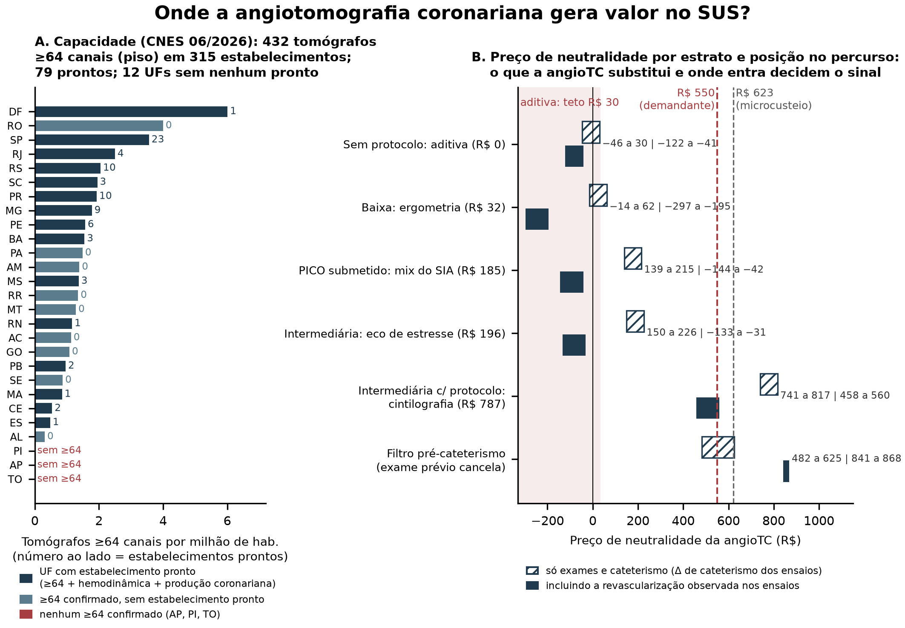
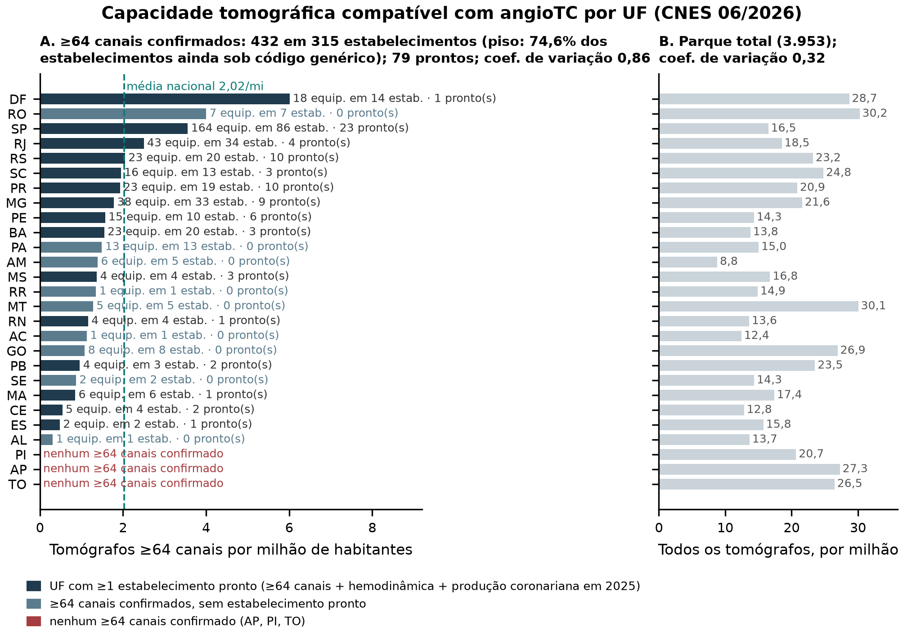
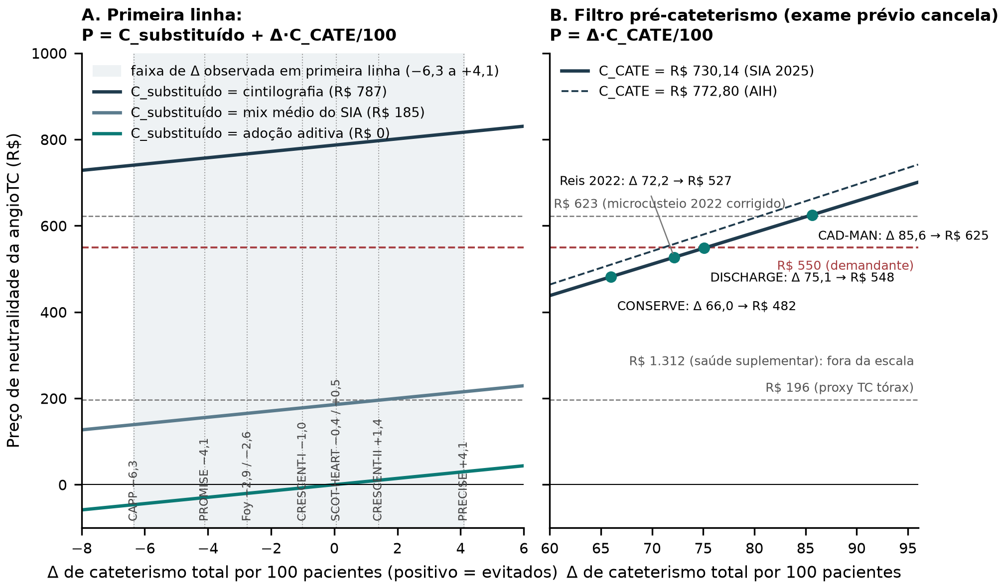

# Onde a angiotomografia coronariana gera valor no Sistema Único de Saúde? Capacidade instalada, limiar orçamentário e o caso do filtro pré-cateterismo

**Título em inglês:** Where Does Coronary CT Angiography Create Value in Brazil's Unified Health System? Capacity, Budget Threshold, and Pre-Catheterization Gatekeeping

**Título resumido:** AngioTC no SUS: capacidade, limiar e filtro

**Autores:** [Autor 1]¹, [Autor 2]², [Autor 3]³, [Autor 4]⁴, [Autor 5]⁵, [Autor sênior]⁶ (ORCID e afiliações a preencher).

**Correspondência:** [Autor 1], [endereço institucional], [e-mail].

**Descritores (DeCS):** Angiografia por Tomografia Computadorizada; Doença da Artéria Coronariana; Avaliação da Tecnologia Biomédica; Custos e Análise de Custo; Sistema Único de Saúde.

**Contagem de palavras:** [Word]

---

## Resumo

**Fundamento:** A Conitec recomendou preliminarmente contra a angiotomografia coronariana (angioTC) como primeira linha na suspeita de doença coronariana estável com probabilidade pré-teste baixa ou intermediária, por incertezas de capacidade e orçamento. Falta perguntar *onde*, não só *se*.

**Objetivos:** Caracterizar a capacidade tomográfica do SUS compatível com angioTC e em que posição do percurso ela é sustentável.

**Métodos:** Análise nacional sobre bases públicas: capacidade por canais após a Portaria SAES/MS 3.695/2026 e análise de limiar (Δ de cateterismo para neutralidade) em dois PICOs (primeira linha; filtro pré-cateterismo), com Δ de dez ensaios e uma metanálise, com e sem revascularização.

**Resultados:** No PICO agregado de primeira linha, os preços avaliados excedem a neutralidade: o exame substituído no SUS é sobretudo a ergometria (76% de 787.954 episódios/ano; R$ 32) e o melhor Δ observado (+4,1/100) não fecha R$ 550; na intermediária, só substituir cintilografia leva R$ 550 à zona de incerteza (R$ 458–560 com revascularização). No filtro pré-cateterismo o sinal inverte: Δ de 66–86/100 e neutralidade a R$ 482–625 (R$ 841–868 com revascularização). Dos 315 estabelecimentos com tomógrafo ≥64 canais (432, piso), 79 reúnem hemodinâmica e produção coronariana; doze UFs, nenhum.

**Conclusões:** A sustentabilidade orçamentária depende da posição no percurso e do exame substituído, não do preço: parâmetros que os registros não identificam e o protocolo define. A evidência econômica não sustenta decisão uniforme para a faixa baixa/intermediária; sustenta condicionar a incorporação ao posicionamento e ao exame substituído, como estratifica a Diretriz SBC de Síndrome Coronariana Crônica 2025, e avaliar o filtro em separado.

---

## Introdução

A investigação da dor torácica estável é uma porta de entrada de alto volume: em 2025 o SUS registrou 787.954 episódios de investigação funcional não invasiva, três quartos deles por teste ergométrico. Em 2026 a Sociedade Brasileira de Cardiologia submeteu à Conitec pedido de incorporação da angioTC como exame de primeira linha em pacientes sintomáticos com probabilidade pré-teste baixa ou intermediária. A recomendação preliminar, de 3 de julho de 2026, foi desfavorável, fundamentada em incertezas sobre capacidade instalada, delimitação da população elegível, comparadores e impacto real sobre cateterismos e testes funcionais.^10,11^ Este artigo argumenta que a pergunta decisiva não é *se* o SUS deve oferecer angioTC, mas *onde* ela entra no percurso, e que a resposta orçamentária muda de sinal conforme esse ponto.

Duas décadas de ensaios randomizados de estratégia, entre eles SCOT-HEART,^1,2^ PROMISE^3^ e DISCHARGE,^4^ deram à angioTC recomendação de classe I nas diretrizes internacionais e brasileiras,^5–9^ quase todas estratificando a indicação por probabilidade pré-teste. A mais recente e específica, a Diretriz SBC de Síndrome Coronariana Crônica 2025,^9^ distingue a probabilidade baixa (IIb-B) da intermediária (I-A). O pedido submetido, calcado na Diretriz SBC/CBR de Tomografia e Ressonância de 2024,^8^ não faz essa distinção e trata "baixa ou intermediária" como faixa única.

As avaliações econômicas brasileiras da angioTC^12–15^ não modelaram a capacidade instalada nem a dependência do posicionamento: o que a tecnologia substitui e em que ponto do percurso entra. Tampouco podiam contar tomógrafos por canais. Até janeiro de 2026 o cadastro nacional usava um código único de tomógrafo; a Portaria SAES/MS 3.695/2026^16^ o desmembrou por número de canais. Este estudo usa esse novo cadastro para caracterizar a capacidade compatível com angioTC e uma análise de limiar para determinar, por posição no percurso e por estrato de probabilidade pré-teste, a que preço a tecnologia é orçamentariamente neutra, com dados públicos e método reproduzível.

## Métodos

**Desenho e escopo.** Análise nacional baseada em modelo, na perspectiva do SUS como pagador e com horizonte de curto prazo: o episódio diagnóstico e os desfechos invasivos imediatos, sem modelar prognóstico. A dor torácica aguda está fora do escopo. A angioTC modelada é a anatômica, sem FFR-CT nem quantificação de placa. As regras de análise foram pré-registradas, com emendas declaradas (Texto S2), e o relato segue o CHEERS 2022.^17^ Por usar apenas dados públicos, agregados ou desidentificados, a análise dispensa apreciação ética (Resolução CNS 510/2016).

**Fontes.** CNES para equipamentos (06/2026); SIA/SUS e SIH/SUS para produção (2025, 27 UFs, todos os arquivos processados sem perda); SIGTAP para preços (08/2026); IBGE para população e IPCA. Todo o acesso foi por FTP público (Tabela S1).

**Capacidade instalada.** A Portaria SAES/MS 3.695/2026 desmembrou o código genérico de tomógrafo em categorias por número de canais. Classificamos cada equipamento disponível ao SUS e em uso como compatível confirmado (≥64 canais, piso adotado por coerência com o NICE, a ESC e o relatório preliminar), incompatível confirmado (<64) ou sem especificação declarada. Sobre os compatíveis, definimos estratos de prontidão crescente: presença de hemodinâmica no mesmo estabelecimento e, além dela, produção coronariana invasiva registrada no SIH em 2025 (Tabela S2). A distribuição foi medida por densidade por milhão de habitantes e a desigualdade por coeficiente de variação e índice de Gini ponderado por população.

**Cenário atual.** Contabilizamos os episódios de investigação funcional (teste ergométrico, ecocardiografia de estresse, cintilografia de perfusão e cintilografia de câmaras), os cateterismos e as Ofertas de Cuidado Integrado (OCI) de síndrome coronariana crônica. A cintilografia de perfusão é registrada em dois códigos, estresse e repouso, etapas de um mesmo exame: contamos um episódio pelo código de estresse. O custo de cada episódio é o valor aprovado dividido pelo número de episódios: preços pagos, não custos de produção.

**Análise de limiar.** O SIA não tem identificador de paciente, e razões entre contagens agregadas não são probabilidades condicionais: não permitem estimar quantos cateterismos a angioTC evitaria. Invertemos a pergunta e calculamos, a cada preço, o Δ de cateterismo total por 100 pacientes necessário para a neutralidade orçamentária. Na primeira linha, o preço de neutralidade é o custo do exame substituído mais o dos cateterismos induzidos, menos o das revascularizações induzidas. No filtro antes de uma cinecoronariografia eletiva já indicada, a investigação prévia é comum aos dois braços e se cancela, restando apenas o crédito dos cateterismos e revascularizações evitados. Adotamos C_CATE = R$ 730,14 (SIA 2025; sensibilidade a R$ 772,80, pela AIH) e os custos de revascularização do SIH 2025 (R$ 7.713 por angioplastia e R$ 25.904 por cirurgia); a revascularização não desagregada é valorada como angioplastia. Preços de referência: R$ 196,41 (TC de tórax com contraste, proxy), R$ 550,00 (demandante), R$ 622,54 (microcusteio de 2022^14^ corrigido pelo IPCA) e R$ 1.311,95 (saúde suplementar^15^). O exame substituído foi modelado em seis cenários, da adoção aditiva (a angioTC somada ao percurso, sem substituir nada) à substituição integral da cintilografia. Por estrato de probabilidade pré-teste, o comparador foi declarado como premissa, a partir das diretrizes e do julgamento clínico dos autores (Texto S2): na baixa, a ergometria ou nenhum exame; na intermediária, a imagem funcional que o serviço realizaria (no SUS, em escala, a cintilografia). As cotas anuais aplicam cada cenário, a R$ 550 e no ponto médio da faixa de Δ, ao volume de 2025 que ele pode substituir. Os Δ de cateterismo e de revascularização vêm de dez ensaios randomizados e uma metanálise,^1,3,4,18–25^ aplicados a cada PICO conforme o desenho de cada estudo (Tabela S4); o Δ de cateterismo da metanálise de Foy é pareado com a revascularização dos mesmos 13 ensaios. O cateterismo sem doença obstrutiva^26^ é reportado como eficiência diagnóstica, fora do cálculo.

**Reprodutibilidade.** Um único script regenera todas as tabelas a partir dos microdados versionados e recusa cobertura parcial. Código e dados estão em repositório público [URL/DOI].

## Resultados

### Capacidade instalada

Em junho de 2026, o SUS dispunha de 432 tomógrafos de ≥64 canais confirmados, em 315 estabelecimentos (Tabela 1). Esse número é um piso, não uma estimativa: 74,6% dos estabelecimentos ainda não haviam migrado do código genérico, de modo que 2.785 equipamentos permanecem sem especificação de canais e uma fração desconhecida deles é também compatível. Dos 315 estabelecimentos, 79 reúnem, além do hardware, sala de hemodinâmica e produção coronariana invasiva documentada em 2025: o estrato com maior plausibilidade de implantar a angioTC sem adquirir tomógrafo.

**Tabela 1 — Parque tomográfico disponível ao SUS e estratos de prontidão (CNES 06/2026).**

| Camada / estrato | Estabelecimentos | Equipamentos |
|---|---|---|
| Compatível confirmado (≥64 canais) | 315 | 432 (293 de 64; 139 de 128) |
| Incompatível confirmado (<64) | 672 | 736 |
| Especificação não declarada | 2.534 | 2.785 |
| Parque total | 3.395 | 3.953 |
| ≥64 + hemodinâmica no mesmo estabelecimento | 114 | — |
| ≥64 + produção coronariana invasiva em 2025 | 96 | — |
| ≥64 + hemodinâmica + produção coronariana | 79 | — |

As camadas se sobrepõem por estabelecimento (77 têm equipamentos ≥64 e <64; 49 têm reclassificados e genéricos): a coluna de estabelecimentos soma 3.521 = 3.395 + 77 + 49; a de equipamentos soma exatamente.

A capacidade compatível é escassa e desigual. A densidade nacional é de 2,02 equipamentos ≥64 canais por milhão de habitantes; Amapá, Piauí e Tocantins não têm nenhum, e doze UFs não têm nenhum estabelecimento no estrato pronto. A desigualdade é mais acentuada sobre o hardware compatível do que sobre o parque total (coeficiente de variação 0,86 contra 0,32; Gini 0,30 contra 0,14), de modo que projeções ancoradas no total de tomógrafos superestimam a capacidade de fato acessível (Figura 1).

### Cenário atual

Em 2025 o SUS realizou 787.954 episódios de investigação funcional, a R$ 146,1 milhões (R$ 185,46 por episódio). O volume e o gasto moram em exames diferentes: o teste ergométrico responde por 76% dos episódios mas só 13% do gasto (R$ 32 cada), enquanto a cintilografia de perfusão responde por 19% dos episódios e 82% do gasto (R$ 787 cada). A ecocardiografia de estresse somou 33.766 episódios (R$ 196 cada) e as OCI de síndrome coronariana crônica, apenas 0,96% do total. Houve 163.803 cateterismos (R$ 730,14), 133.934 angioplastias (R$ 7.713) e 23.290 revascularizações cirúrgicas (R$ 25.904). Não existe código para a angioTC, e o de contraste para tomografia tem faturamento zero: a produção que exista é administrativamente invisível.

### Análise de limiar

Nos ensaios de primeira linha, o Δ de cateterismo variou de −6,3 (CAPP) a +4,1 por 100 (PRECISE); contra cateterismo direto, de 66,0 (CONSERVE) a 85,6 (CAD-MAN) (Figura 2; Tabela S3). O preço de neutralidade depende inteiramente do que a angioTC substitui e de onde entra (Tabela 2).

Como primeira linha, no PICO agregado, nenhum preço plausível fecha. Sem substituir nada (a adoção aditiva, cenário de referência quando não há protocolo), o teto de neutralidade é R$ 30 por exame, abaixo do menor preço de referência. Com o comparador que as diretrizes indicam em cada faixa, o quadro não melhora: na probabilidade baixa (nenhum exame ou ergometria), R$ 550 está muito fora do alcance; na intermediária, só entra na zona de incerteza quando substitui a cintilografia, e ainda assim a revascularização induzida o traz de volta a R$ 458–560. Substituindo a ecocardiografia, R$ 550 fica fora. O nicho da cintilografia tem no máximo 151.784 episódios por ano, e a fração substituível é menor: parte é feita em doença conhecida e parte em pacientes idosos, obesos, com fibrilação atrial ou calcificação extensa, nos quais a angioTC rende pior. A média não estratificada é puxada para o estrato baixo, porque três quartos do volume atual são ergometria. Ao preço da saúde suplementar, a primeira linha substituindo o mix médio exigiria mais cateterismos evitados do que pacientes (154 por 100).

Como filtro antes de um cateterismo já indicado, o sinal se inverte. O exame prévio se cancela, o preço de neutralidade fica em R$ 482–625 só com exames e sobe para R$ 841–868 quando se credita a revascularização evitada. Ao preço proposto de R$ 550, o limiar exigido é 75,3 cateterismos evitados por 100, que o DISCHARGE (75,1) praticamente alcança em pacientes já referenciados ao cateterismo, enquanto o melhor Δ de primeira linha é apenas 4,1. O mesmo limiar de 75,3 aparece na adoção aditiva porque, sem substituição, a equação é a do filtro; o que muda é a origem do Δ.

**Tabela 2 — Preço de neutralidade da angioTC por estrato de probabilidade pré-teste, comparador (premissa) e posição no percurso; Δ observado nos ensaios, com e sem revascularização.**

| Estrato | Comparador (premissa) | C_subst. | Só exames + cateterismo | Com revascularização | Δ exigido a R$ 550 |
|---|---|---|---|---|---|
| Sem protocolo (qualquer estrato) | adoção aditiva (nada substituído) | R$ 0 | R$ −46 a +30 (SCOT-HEART: −3 a +4) | R$ −122 a −41 | 75,3 |
| Baixa | teste ergométrico | R$ 32 | R$ −14 a +62 | R$ −297 a −195 | 70,9 |
| Não estratificado (PICO submetido) | mix médio do SIA | R$ 185 | R$ 139 a 215 | R$ −144 a −42 | 49,9 |
| Intermediária, sensibilidade | ecocardiografia de estresse | R$ 196 | R$ 150 a 226 | R$ −133 a −31 | 48,4 |
| Intermediária, com protocolo (base) | cintilografia de perfusão | R$ 787 | R$ 741 a 817 | R$ 458 a 560 | já neutro |
| Cateterismo já indicado (filtro) | cateterismo direto (CONSERVE / Reis / DISCHARGE / CAD-MAN) | cancela | R$ 482 / 527 / 548 / 625 | R$ 841 (DISCHARGE); R$ 868 (CONSERVE) | 75,3 |

Notas: Δ de cateterismo de primeira linha de −6,3 a +4,1 por 100. A coluna com revascularização pareia cada Δ de cateterismo com a revascularização do mesmo estudo (PRECISE, +4,0/100, −R$ 359; Foy, 13 ensaios, +2,7/100, −R$ 208), por isso varre faixa mais estreita que a coluna sem revascularização; esse envelope superestima o débito na baixa; SCOT-HEART (+1,5 e +0,6/100) no aditivo; DISCHARGE (−3,8/100; +R$ 293) e CONSERVE (−5,0/100; +R$ 386) no filtro. Com C_CATE = R$ 772,80, o filtro vai a R$ 510–662. Cenários adicionais (diferimento na baixa; percurso misto adotado pelo NATS, núcleo de avaliação de tecnologias do relatório preliminar, por episódio; descritivo sem protocolo, ergometria seguida de imagem em fração p ≤ 0,31) na Tabela S8.

### Eficiência diagnóstica e ordem de grandeza anual

Num segundo desfecho, apresentado como eficiência diagnóstica e mantido fora do cálculo econômico, a angioTC evita cateterismos sem doença obstrutiva em ambos os PICOs: de 0,9 a 5,9 por 100 contra estratégias funcionais (OR 0,77, IC95% 0,64–0,94, nos estudos de alta certeza) e de 53,7 a 81,0 por 100 contra cateterismo direto.^26^ A direção favorece a angioTC consistentemente, o que sustenta o ganho de adequação da indicação como o benefício mais robusto no horizonte de curto prazo (Tabela S6). Em ordem de grandeza anual, a R$ 550 e sobre o volume substituível, a adoção aditiva somaria +R$ 440 milhões; a substituição da cintilografia, −R$ 35 a +R$ 6 milhões; o filtro, +R$ 11 a −R$ 48 milhões. São cotas, não impacto orçamentário: a população elegível é fração não identificável dos denominadores (Tabela S7; Figura S1).

## Discussão

### Achado principal

Uma mesma tecnologia, ao mesmo preço, é orçamentariamente expansiva ou fica na zona de incerteza conforme três parâmetros: onde entra no percurso, o que substitui e quanta revascularização induz. Nenhum é identificável nos registros brasileiros; mas o que os registros não dizem, as diretrizes dizem, e declarar o comparador realista de cada faixa como premissa converte a limitação em resultado.

Na probabilidade baixa, as diretrizes recomendam diferir ou usar escore de cálcio, enquanto o SUS faz uma ergometria de R$ 32: a angioTC não substitui nada de valor e é expansiva a qualquer preço plausível. Na intermediária, a ecocardiografia a R$ 196 não financia a troca; a cintilografia a R$ 787 financia, até que a revascularização adicional traga o preço de neutralidade de volta a R$ 458–560, cercando os R$ 550 propostos. Só no filtro antes de uma cinecoronariografia já indicada a angioTC cruza o limiar com folga.

O cenário aditivo, a angioTC somada ao percurso sem substituir nada, é o mais desfavorável e, a nosso juízo, o mais provável se a incorporação criar o código sem protocolo. No SUS, a ergometria costuma preceder o encaminhamento ao cardiologista, e a própria Diretriz SBC de SCC 2025 sugere, "se [capacidade funcional] preservada, iniciar com TE ou ecocardiograma de estresse";^9^ uma angioTC solicitada na especialidade chega depois dela, não em seu lugar. É juízo sobre implementação, não medida. Assim, "primeira linha" no SUS como ele é significa substituir a ergometria, e isso não fecha a nenhum preço plausível. A angioTC paga quando entra depois da ergometria: no lugar do encaminhamento à cintilografia (intermediária com protocolo) ou da cinecoronariografia eletiva já indicada (filtro). Capacidade e posicionamento apontam para o mesmo lugar: os 79 estabelecimentos prontos são hospitais com hemodinâmica, exatamente onde o paciente referenciado ao cateterismo já está.

### O que dizem as diretrizes

Das cinco diretrizes vigentes, apenas o NICE^5^ posiciona a angioTC como primeira linha uniforme na faixa "baixa ou intermediária"; as demais estratificam (Tabela S5). A ESC 2024^7^ a considera preferida só na probabilidade de 5–50% e recomenda imagem funcional a partir de 15%. A AHA/ACC 2021^6^ trata angioTC e imagem de estresse como co-iguais no risco intermediário-alto e, no baixo, recomenda escore de cálcio ou ergometria. O pedido submetido reproduz a formulação da Diretriz SBC/CBR de TC/RM 2024,^8^ que não distingue as faixas; mas a Diretriz SBC de Síndrome Coronariana Crônica 2025,^9^ posterior e específica, separa a baixa (IIb-B) da intermediária (I-A) e condiciona a escolha do exame inicial ao serviço e ao paciente: capacidade funcional, ECG basal, acesso local e função renal. A diretriz não diz qual exame a angioTC substitui; diz que depende, que é a tese deste artigo. O filtro antes de cinecoronariografia já indicada é endossado, em graus diferentes, por quatro das cinco diretrizes, e é a indicação com maior espaço econômico, embora não seja a que foi requerida.

### Capacidade

O CNES agora permite contar tomógrafos por canais, mas 74,6% dos estabelecimentos ainda não migraram: os 432 são piso. Dos 432, 293 são de 64 canais, faixa em que equipamentos de gerações antigas entregam dose muito maior em aquisição retrospectiva; o CNES não registra geração nem ano, mais um motivo para tratar "≥64" como piso. O estrato de 79 é o de maior plausibilidade de implantação sem comprar tomógrafo, mas software, sincronização, injetora e leitores habilitados não constam do cadastro. O gargalo previsível é a equipe, não o equipamento: o telelaudo supre a leitura, não a aquisição. Com doze UFs sem estabelecimento pronto, incorporar sem estratégia regional consolidaria a desigualdade.

### A literatura econômica, lida pela mesma chave

Os ensaios com desfecho de custo confirmam o sinal que a Tabela 2 prevê. O PROMISE, com comparador majoritariamente cintilográfico, não encontrou economia aos 90 dias nem aos 3 anos.^27^ O SCOT-HEART custou +US$ 462 por paciente aos 6 meses, sem diferença a jusante.^1^ O PRECISE reduziu o custo diagnóstico em 27% mas aumentou o de revascularização em 67%.^21^ No Brasil, os modelos de custo-efetividade de longo prazo de Bertoldi^12,13^ respondem a uma pergunta distinta (benefício clínico ao longo do tempo), não contraditória; e o microcusteio de Carmo^14^ precificou a angioTC (R$ 452) contra comparadores de tabela, a mesma assimetria que este estudo herda e declara.

O confronto mais instrutivo é com Shiozaki et al.,^15^ o estudo mais recente e mais presente no debate público, que estima economia de R$ 1.021 por beneficiário em cinco anos numa carteira de 100.000 vidas da saúde suplementar. Ele compara a angioTC (R$ 1.311,95) com a angiografia invasiva como estratégia inicial (R$ 1.900,79, único comparador), com eventos do DISCHARGE, e declara não ter comparado com testes funcionais. Ou seja, é um modelo do filtro pré-cateterismo, não da primeira linha. Nesse desenho o Δ exigido é 69 por 100, que o DISCHARGE (75,1) alcança. Transposto ao SUS, o mesmo mecanismo sustenta o filtro (R$ 482–868), não a primeira linha, que ao mesmo preço exigiria 154 cateterismos evitados por 100 pacientes. Mesma tecnologia, sinal oposto: não pelos preços relativos, mas pelo comparador. A economia, ademais, é por beneficiário de carteira, não por paciente examinado; as projeções de dezenas de bilhões veiculadas na imprensa não constam do artigo, que as qualifica como projeção teórica para a saúde suplementar.^28^

### Limitações

A principal limitação é de dado: sem identificador de paciente, a análise responde a uma pergunta inversa, não a uma estimativa de procedimentos evitados. A probabilidade pré-teste não está nos registros, de modo que a estratificação é premissa declarada, e os denominadores incluem assintomáticos e doença conhecida. O código de cateterismo é genérico e o CNES é autodeclarado e incompleto. Quanto ao modelo: os preços são de tabela, não custos, inclusive o do cateterismo, que credita cada Δ (se seu custo real for maior, o filtro melhora e a primeira linha não muda); a substituição é tratada como 1:1; e o horizonte curto exclui de propósito o benefício do SCOT-HEART aos 5 e 10 anos,^2^ atribuído à terapia preventiva. O débito de revascularização entra como custo sem modelar o alívio de angina que a acompanha. Contraindicações relativas (doença renal, contraste, frequência, calcificação) reduzem a população elegível; complicações, permanência, exames não diagnósticos e achados incidentais não foram quantificados. Quanto à evidência: o Δ é diferença aritmética por braço em horizontes heterogêneos, não metanálise; as contagens do CAPP vêm da metanálise de Foy; e a revascularização de Foy vem de população majoritariamente de emergência.

A limitação metodológica mais importante é a assimetria entre a angioTC microcusteada e os comparadores a preços de tabela. Ela não trava a conclusão (o sinal na baixa depende de razões de preço que um microcusteio dificilmente inverteria, e a direção na intermediária já é declarada incerta), mas define uma agenda: microcusteio *bottom-up* da angioTC e dos comparadores no mesmo serviço, por método único,^29^ em ao menos oito serviços cobrindo as cinco regiões e as três naturezas, incluindo o estrato pronto (Texto S1).

### Implicações

A pergunta talvez não seja se o SUS deve ter angioTC, mas quais pacientes a recebem primeiro e o que ela substitui. Primeiro, condicionar a incorporação a um protocolo que especifique posicionamento e substituição. Sem ele, o cenário de referência é o aditivo, em que nenhum preço plausível é neutro: a sustentabilidade é propriedade do protocolo, não do preço. O protocolo já existe na Diretriz SBC de SCC 2025, e o instrumento administrativo também: as OCI de síndrome coronariana crônica remuneram por episódio e nomeiam o exame de cada progressão. Uma progressão anatômica, em alternativa à progressão II (cintilografia, R$ 840), incorporaria a substituição no próprio código. O protocolo deve excluir explicitamente o assintomático, indicação de classe III em todas as diretrizes, porque código sem protocolo vira rastreamento.

Segundo, avaliar o filtro antes de cinecoronariografia já indicada como pergunta separada: a indicação com maior espaço econômico e respaldo de diretriz. Terceiro, criar o código SIGTAP e microcustear angioTC e comparadores. Quarto, completar a reclassificação do CNES antes da apreciação final e implantar a partir do estrato pronto, com estratégia regional para as doze UFs sem estabelecimento.

## Conclusão

Após a Portaria SAES/MS 3.695/2026, o cadastro nacional responde pela primeira vez à pergunta de capacidade: 432 tomógrafos de ≥64 canais em 315 estabelecimentos, como piso, e 79 prontos, com forte desigualdade regional. A pergunta orçamentária, por sua vez, não tem resposta única, e isso é o achado. Sem protocolo, a angioTC entra somada ao percurso e nenhum preço plausível a torna neutra. Com protocolo, é expansiva na probabilidade baixa, incerta na intermediária quando substitui a cintilografia (e apenas ela), e tem espaço como filtro antes de uma cinecoronariografia já indicada. Essa estratificação já está na Diretriz de Síndrome Coronariana Crônica da SBC de 2025, posterior à formulação que o pedido reproduz. A evidência econômica não sustenta uma decisão uniforme para toda a faixa baixa ou intermediária; sustenta condicionar qualquer incorporação ao posicionamento e ao exame substituído, com o protocolo que a cardiologia brasileira já publicou, e avaliar em separado, com critérios próprios, o filtro antes da cinecoronariografia já indicada, onde o espaço econômico é maior e o estrato pronto já está.

## Declarações

**Contribuição dos autores:** concepção e desenho da pesquisa: [Autor 1], [Autor sênior]. Obtenção de dados: [Autor 1]. Análise e interpretação dos dados: [todos]. Análise estatística: [Autor 1]. Redação do manuscrito: [Autor 1]. Revisão crítica quanto ao conteúdo intelectual importante: [Autores 2–6]. **Conflitos de interesse:** [declarar por extenso, últimos 2 anos]. **Financiamento:** nenhum. **Vinculação acadêmica:** [se aplicável]. **Aprovação ética:** não se aplica (dados públicos, sem identificação). **Disponibilidade de dados e código:** repositório público [URL/DOI], licenças CC BY 4.0 e MIT. **Uso de inteligência artificial:** assistência em extração de dados, código e redação, sob responsabilidade dos autores.

## Legendas

**Figura central.** Onde a angioTC gera valor no SUS. (A) tomógrafos ≥64 canais por milhão por UF, estabelecimentos prontos (n = 79) e UFs sem nenhum (n = 12). (B) preço de neutralidade por estrato e posição no percurso, só exames (hachura) e com revascularização (cheio), com marcações em R$ 550 e R$ 623 e a faixa "sem protocolo (aditiva): teto R$ 30".

**Figura 1.** Capacidade tomográfica compatível com angioTC por UF (CNES 06/2026): equipamentos ≥64 canais por milhão, estrato pronto, UFs sem ≥64 canais e parque total.

**Figura 2.** Preço de neutralidade em função do Δ de cateterismo total por 100 pacientes. Retas de primeira linha com C_substituído = R$ 0 (aditiva), R$ 185 (mix) e R$ 787 (cintilografia), e reta do filtro pré-cateterismo. Δ de dez ensaios e uma metanálise; preços de referência.

## Referências

1. SCOT-HEART Investigators. CT coronary angiography in patients with suspected angina due to coronary heart disease (SCOT-HEART). Lancet. 2015;385(9985):2383-91; Williams MC, et al. J Am Coll Cardiol. 2016;67(15):1759-68; Newby DE, et al. N Engl J Med. 2018;379(10):924-33.
2. Williams MC, Wereski R, Tuck C, et al. Coronary CT angiography-guided management of patients with stable chest pain: 10-year outcomes from the SCOT-HEART randomised controlled trial. Lancet. 2025;405(10475):329-37.
3. Douglas PS, Hoffmann U, Patel MR, et al. Outcomes of anatomical versus functional testing for coronary artery disease (PROMISE). N Engl J Med. 2015;372(14):1291-300.
4. DISCHARGE Trial Group. CT or invasive coronary angiography in stable chest pain. N Engl J Med. 2022;386(17):1591-602.
5. National Institute for Health and Care Excellence. Recent-onset chest pain of suspected cardiac origin: assessment and diagnosis (CG95). 2010, atualizada 2016.
6. Gulati M, Levy PD, Mukherjee D, et al. 2021 AHA/ACC/ASE/CHEST/SAEM/SCCT/SCMR Guideline for the Evaluation and Diagnosis of Chest Pain. Circulation. 2021;144(22):e368-454.
7. Vrints C, Andreotti F, Koskinas KC, et al. 2024 ESC Guidelines for the management of chronic coronary syndromes. Eur Heart J. 2024;45(36):3415-537.
8. Magalhães TA, Carneiro ACC, Moreira VM, et al. Diretriz de Tomografia Computadorizada e Ressonância Magnética Cardiovascular da SBC e do CBR – 2024. Arq Bras Cardiol. 2024;121(9):e20240608.
9. Cesar LAM, Gowdak LHW, Pavanello R, et al. Diretriz de Síndrome Coronariana Crônica – 2025. Arq Bras Cardiol. 2025;122(9):e20250619.
10. Brasil. Ministério da Saúde. Conitec. Relatório para a Sociedade nº 745: angiotomografia coronariana como exame de primeira linha em pacientes sintomáticos e probabilidade pré-teste baixa ou intermediária com suspeita de doença arterial coronariana estável. Brasília; ago 2026.
11. Brasil. Ministério da Saúde. Conitec. Relatório de Recomendação Preliminar — angiotomografia coronariana como exame de primeira linha. Consulta Pública nº 73/2026. Brasília; 2026.
12. Bertoldi EG, Stella SF, Rohde LE, Polanczyk CA. Long-term cost-effectiveness of diagnostic tests for assessing stable chest pain: modeled analysis of anatomical and functional strategies. Clin Cardiol. 2016;39(5):249-56.
13. Bertoldi EG, Stella SF, Rohde LEP, Polanczyk CA. Cost-effectiveness of anatomical and functional test strategies for stable chest pain: public health perspective from a middle-income country. BMJ Open. 2017;7(4):e012652.
14. Carmo PB, Magliano CAS, Rey HCV, Camargo GC, Trocado LFL, Gottlieb I. Análise da custo-efetividade da angiotomografia coronariana no SUS, em comparação com outros métodos não invasivos na suspeita de DAC estável. Arq Bras Cardiol. 2022;118(3):578-85.
15. Shiozaki A, Torreão J, Costa IBSS, Suarez AB, Silva MT, Oliveira TG, et al. Análise de custo-efetividade da angiotomografia coronária como exame preferencial na investigação de dor torácica estável na saúde suplementar no Brasil. Arq Bras Cardiol. 2025;122(12):e20250204.
16. Brasil. Ministério da Saúde. Portaria SAES/MS nº 3.695, de 15 de janeiro de 2026. Diário Oficial da União. 27 jan 2026; Seção 1:89-90. Republicada 18 mai 2026.
17. Husereau D, Drummond M, Augustovski F, et al. Consolidated Health Economic Evaluation Reporting Standards 2022 (CHEERS 2022) statement. Value Health. 2022;25(1):3-9.
18. Lubbers M, Dedic A, Coenen A, et al. Calcium imaging and selective computed tomography angiography in comparison to functional testing for suspected coronary artery disease (CRESCENT). Eur Heart J. 2016;37(15):1232-43.
19. Lubbers M, Coenen A, Kofflard M, et al. Comprehensive cardiac CT with myocardial perfusion imaging versus functional testing in suspected coronary artery disease (CRESCENT-II). JACC Cardiovasc Imaging. 2018;11(11):1625-36.
20. McKavanagh P, Lusk L, Ball PA, et al. A comparison of cardiac computerized tomography and exercise stress electrocardiogram test for the investigation of stable chest pain (CAPP). Eur Heart J Cardiovasc Imaging. 2015;16(4):441-8.
21. Douglas PS, Nanna MG, Kelsey MD, et al. Comparison of an initial risk-based testing strategy vs usual testing in stable symptomatic patients with suspected coronary artery disease (PRECISE). JAMA Cardiol. 2023;8(10):904-14; desfechos econômicos: Chew DS, et al. Circ Cardiovasc Qual Outcomes. 2025;18(2):e011008.
22. Foy AJ, Dhruva SS, Peterson B, Mandrola JM, Morgan DJ, Redberg RF. Coronary computed tomography angiography vs functional stress testing for patients with suspected coronary artery disease: a systematic review and meta-analysis. JAMA Intern Med. 2017;177(11):1623-31.
23. Dewey M, Rief M, Martus P, et al. Evaluation of computed tomography in patients with atypical angina or chest pain clinically referred for invasive coronary angiography (CAD-Man). BMJ. 2016;355:i5441.
24. Chang HJ, Lin FY, Gebow D, et al. Selective referral using CCTA versus direct referral for individuals referred to invasive coronary angiography for suspected CAD (CONSERVE). JACC Cardiovasc Imaging. 2019;12(7 Pt 2):1303-12.
25. Reis JF, Freitas P, Guerreiro S, et al. Cardiac computed tomographic angiography after abnormal ischemia test as a gatekeeper to invasive coronary angiography. Int J Cardiovasc Imaging. 2022;38(4):883-93.
26. Institut für Qualität und Wirtschaftlichkeit im Gesundheitswesen. Coronary computed tomography angiography for the diagnosis of chronic coronary heart disease. Final report D22-01. Colônia; 2024. NCBI Bookshelf NBK602895.
27. Mark DB, Federspiel JJ, Cowper PA, et al. Economic outcomes with anatomical versus functional diagnostic testing for coronary artery disease (PROMISE). Ann Intern Med. 2016;165(2):94-102.
28. Duarte M. Doenças cardiovasculares causam mais de 300 mil mortes por ano no Brasil; Conitec abre consulta pública sobre angiotomografia coronariana no SUS [release de imprensa]. Jornal do Brás. 11 ago 2026. Acesso em 16 ago 2026.
29. Brasil. Ministério da Saúde. Diretriz metodológica: estudos de microcusteio aplicados a avaliações econômicas em saúde. Brasília; 2021.
